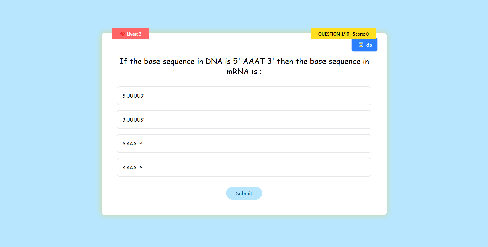
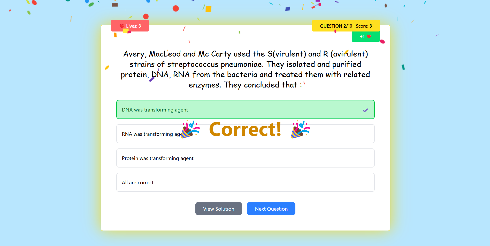
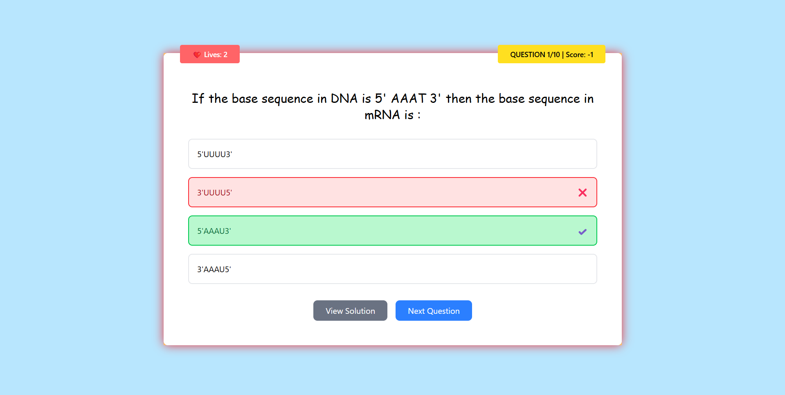
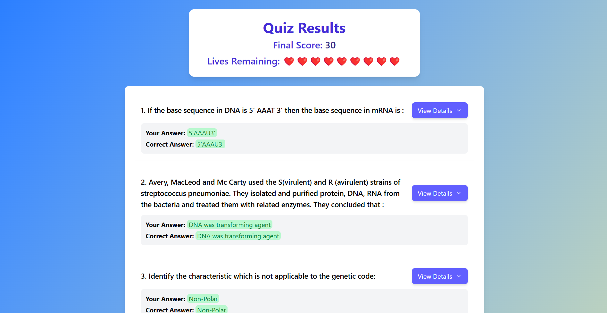
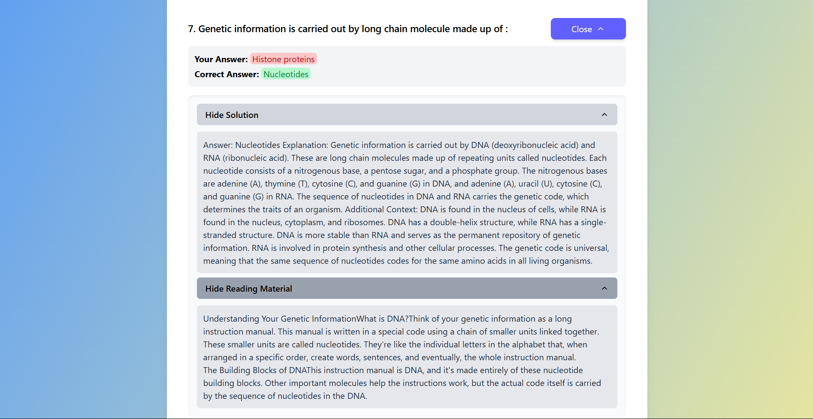
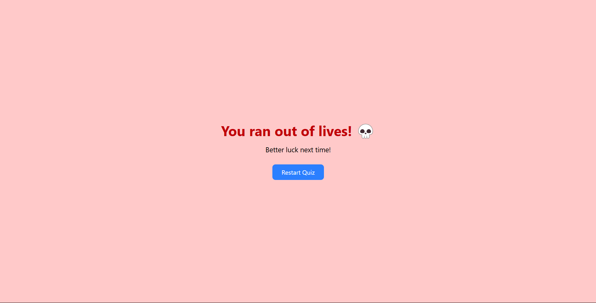

# Quiz App

## Overview

This is an interactive quiz application built using React, Redux, and Framer Motion. The app provides a visually appealing UI with animations, a smooth user experience, and gamification features such as a timer and lives system.

## Features

### 1. **Dynamic Quiz Handling**

- The quiz fetches questions dynamically from an API and updates the UI accordingly.
- Questions are displayed one by one, with multiple-choice options for the user to select from.

### 2. **State Management with Redux**

- The app uses Redux to manage the quiz state, including questions, user responses, and game progress.

### 3. **Local Storage Integration**

- The quiz title, topic and users progress are stored in local storage and retrieved upon page refresh. This ensures that if the user accidentally refreshes the web page, their progress is not lost.

### 4. **Lives System** ❤️

- Users have a limited number of lives.
- Incorrect answers deduct a life.
- The game ends if all lives are lost before the quiz is completed.

### 5. **Timer Feature** ⏳

- A countdown timer is implemented to allow the user to regain a new live.
- If the user submits the correct answer before the timer goes out, the user will be granted a new live and if the user fails to submit the correct answer before the timer goes out no additional lives will be granted to the user.

### 6. **Animations with Framer Motion**

- The app includes animations such as rotating stars and interactive elements for an engaging experience.

### 7. **Gamification Elements**

- The quiz includes engaging UI elements like animations and dynamic transitions.
- Users receive immediate feedback on their answers, which allows them to know the correct answer for the respective question immediately when they submit their answer.
- Users can view the solution for a particular question immediately after they submit their answer.

## Technologies Used
- React.js
- Redux
- Framer Motion
- React Router

## Setup Instructions

1. Clone the repository:
   ```sh
   git clone https://github.com/piyushpawar079/Quiz-Website.git
   ```

2. Navigate to the project folder:
    ```sh
    cd Quiz-Website
    ```

3. Install dependencies:
    ```sh
    npm install
    ```

4. Start the development server:
    ```sh
    npm run dev
    ```

## Screenshots

### Home Page


### Quiz Screen


### After right submission


### After wrong submission


### Result Page


### Information about particulater question


### After users lives become zero


## Demo Video

